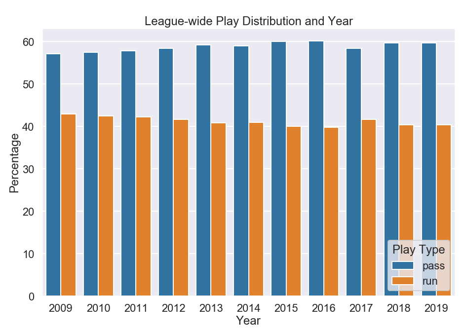
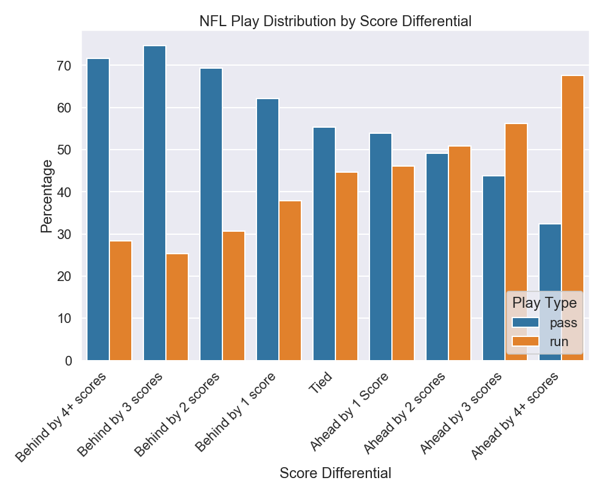
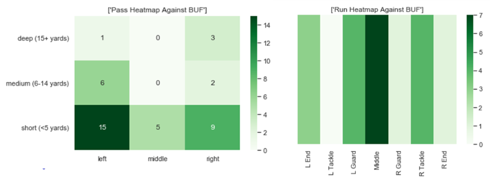

# Analysis and Predictive Modeling for NFL Playcalling

One of the most legendary quotes in American Football belongs to coach Paul “Bear” Bryant who said "Defense wins championships." In the wake of phenomenal offensive talents such as Patrick Mahomes and Lamar Jackson, it's apparent that the league has shifted towards an offense-focused mindset. It's hard to argue with results, especially when they result in championships. Regardless, there is a reason why coaches and players spent hours upon hours reviewing film of their opponents. Film sessions are done to point out what type of plays offenses like to run and help better prepare the defense for your opponent. You might not be able to completely stop a player like Mahomes but if you can slow him down, you can put your team in a better position to win.

The purpose of this project was to analyze NFL offense tendencies and design a predictive model that could accurately predict whether a team is planning on passing or running the ball. By looking at play-by-play data from all NFL regular season games, I wanted to identify any trends in offense play-calling that have become prevalent in recent years. I also developed visualizations to help provide an in-depth look into which sides of the field an offense liked to attack when running or passing the ball. By learning a team's tendencies on offense, you can have your defense in a better situation to anticipate the play-call and make a stop or even force a turnover.

# Data Information:

The majority of the dataset used came from a dataset on Kaggle. This dataset contains play-by-play details for all regular season games going back to 2009. It contains various columns about each play, such as a description of the play, how many yards were gained on the play, and which players were involved. Supplemental information was taken from www.pro-football-reference.com and NFL Game Pass for video corroboration. The original dataset can be accessed through this link: https://www.kaggle.com/maxhorowitz/nflplaybyplay2009to2016

# Libraries Used in this Project:

* Pandas for data cleaning and data manipulation
* Matplotlib and Seaborn for data visualizations
* Sci-kit Learn for machine learning modeling
* BeautifulSoup for data scraping

# Data Visualizations

With access to a vast amount of play-by-play data and stats, I wanted to add an additional component to my project. I decided to put it towards creating visualizations that could show how the league and individual teams have changed over the years. There are certain notions about how football has evolved over the years that I wanted to look at, such as a common thought that the NFL has become a “pass-heavy” league. The reality is that the pass-run ratio has barely changed in recent years.

## Play-Calling Dashboard

As part of this project, I wanted to create visualizations that would help identify trends and tendencies for each NFL team. Not only would I be able to show how a certain team has changed over the years, but I can highlight a team's performance and patterns for a particular season. For example, I can see how much a team may favor running on first down or at what point is it more expected that a team will throw depending on how late into the game it is.

In addition to plotting trends and tendencies for each team, I also created heatmap visualizations highlighting where each team preferred to throw and run the ball against each opponent. These heatmaps are useful to show which sides of the field a team's offense preferred when going against a particular team. Since NFL teams generally plan and scheme their offense to counter defensive schemes, it helps to highlight potential weaknesses and methods of attack.

# Predictive Modeling:

I used a number of machine learning models that were designed to predict whether a play would be be a pass or run. Each of the models were provided with details that a defense would have previous to the play occurring, such as the score differential and the yards to go for a first down. The following models were used:

* Logistic Regression
* Decision Trees
* Ensemble Methods with Decision Trees
* Random Forests
* XGBoost

The main metric used to compare each model's performance was its overall accuracy and the recall for a pass play. The reason recall for a play was used is due to the fact that, on average, a pass play would yield more yards than a run play.

XGBoost performed the best out of all the models tested in terms of overall accuracy and pass recall.

# Future Work:

One of the most crucial components of a play not featured within this dataset was the personnel used on the play. As an example, certain personnel sets (ones with more TEs as blockers) are better suited for run plays. In addition, knowing who is on the field can provide valuable insights for what kind of play to suspect. I'd also like to incorporate playoff situations into the model. Towards the end of the season, teams that are fighting for a playoff spot will be more aggressive as they cannot afford to lose crucial games. Teams in need of a win will do what it takes to ensure they are in contention during the game. I would also like to do a web deployment where you can access the visualizations of play-calling trends and pass/run locations for each NFL team.

Link to the Medium Blog for this project: https://medium.com/@msf894/analysis-and-predictive-modeling-for-play-calling-in-the-nfl-fb6976134a93
